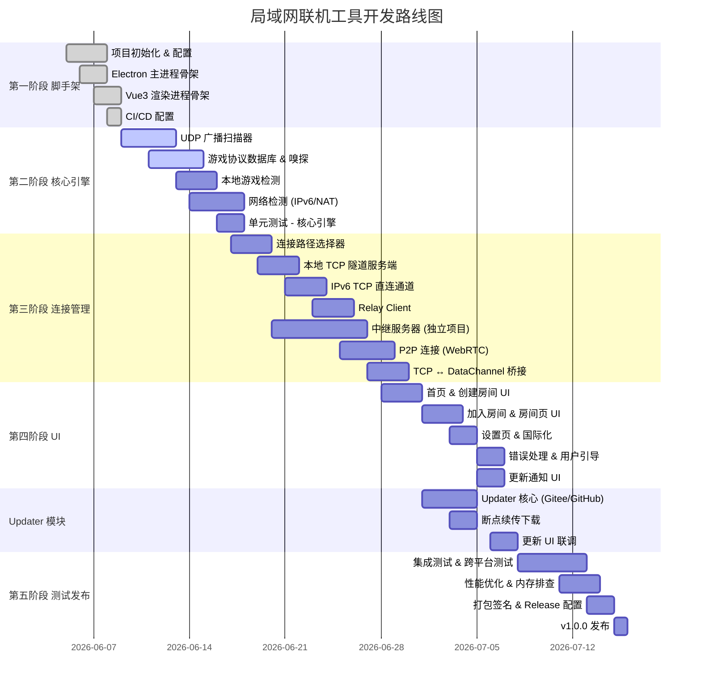

# 开发计划

## 里程碑概览



---

## 第一阶段：项目脚手架（第 1 周）

### 任务清单

```
[ ] 1.1 使用 electron-vite 或 Vite + electron-builder 初始化项目
        - 选择模板：electron-vite-vue-typescript
        - 配置 TypeScript (tsconfig.json)
        - 配置 ESLint + Prettier
        - 验证开发环境：npm run dev

[ ] 1.2 Electron 主进程骨架
        - main.js：应用入口，创建 BrowserWindow
        - window-manager.js：窗口创建/关闭/最小化到托盘
        - ipc-handlers.js：IPC 通道注册框架
        - tray.js：系统托盘（右键菜单）
        - 启用 contextIsolation + preload script

[ ] 1.3 Vue3 渲染进程骨架
        - Vue Router：首页 / 创建房间 / 加入房间 / 房间页 / 设置
        - Pinia Store：room、discovery、tunnel、settings
        - Naive UI 按需引入
        - UnoCSS 配置
        - 基础页面占位符，可路由跳转

[ ] 1.4 CI/CD (GitHub Actions)
        - Lint + Type Check
        - 单元测试
        - 构建：Windows / macOS / Linux
        - 自动发布 Release (electron-builder)
```

**交付物**：
- 可在 `npm run dev` 下运行的 Electron 窗口
- 路由可正常切换
- CI 绿标

---

## 第二阶段：核心引擎（第 2-3 周）

### 任务清单

```
[ ] 2.1 UDP 广播扫描器 (src/core/discovery/scanner.ts)
        - UDP 广播发送（255.255.255.255:发现端口）
        - UDP 广播接收与解析
        - 游戏信息数据模型
        - 超时移除机制（15 秒无响应）
        - 单元测试

[ ] 2.2 UDP 响应器 (src/core/discovery/responder.ts)
        - 监听 UDP 广播并回应本机游戏信息
        - 房主侧需要广播自己的游戏

[ ] 2.3 游戏协议数据库 (src/core/discovery/game-db.ts)
        - 预制 7+ 款游戏的端口/协议/进程名
        - 可扩展的插件式注册
        - 协议嗅探框架

[ ] 2.4 游戏协议嗅探 (src/core/discovery/protocols/)
        - Minecraft: 握手协议检测 (0x00 包)
        - Terraria: 端口是否开放 + 版本匹配
        - Stardew Valley: TCP 端口检测
        - 通用检测: TCP 端口开放 + 默认端号匹配

[ ] 2.5 本地游戏检测 (src/core/game-detect/)
        - process-scanner.ts: 跨平台进程枚举
        - port-checker.ts: 本机端口监听检测
        - 将检测结果上报给渲染进程

[ ] 2.6 网络检测 (src/core/network-detect/)
        - IPv6 能力检测：网卡扫描、公网 IPv6 可达性验证
        - NAT 类型检测：RFC 3489 STUN 流程（FullCone / Restricted / Symmetric）
        - 检测结果数据模型 NetworkInfo
        - 并行检测（IPv6 + NAT 同时进行，总耗时约 1-2 秒）
        - 单元测试

[ ] 2.7 共享类型定义 (src/shared/types.ts)
        - GameInfo, RoomInfo, NetworkInfo, NatType, ConnectionPath 等
```

**交付物**：
- 命令行可测试的 LAN 扫描功能
- 可检测到本机运行的 Minecraft/Terraria 服务器
- **网络检测模块可检测 IPv6 能力和 NAT 类型**
- 单元测试覆盖率 > 80%

---

## 第三阶段：连接管理（第 4-6 周）

### 任务清单

```
[ ] 3.1 连接路径选择器 (src/core/connection/path-selector.ts)
        - 接收房主 NetworkInfo 和加入者 NetworkInfo
        - IPv6 直连判定（双方 hasPublicV6 === true）
        - P2P 可用性判定（双方 NAT 非 Symmetric）
        - Relay 兜底
        - 每加入者独立选路

[ ] 3.2 本地 TCP 隧道服务端 (src/core/tunnel/local-server.ts)
        - 在本地监听 TCP 端口（IPv4 + IPv6 双栈）
        - 接受游戏客户端连接
        - 可插拔传输层：支持 IPv6 TCP / WebRTC P2P / Relay 三种
        - 连接池管理

[ ] 3.3 IPv6 TCP 直连通道 (src/core/tunnel/ipv6-direct.ts)
        - 通过 IPv6 TCP Socket 直接互联
        - 使用 net.createServer / net.createConnection
        - 断线降级到 P2P 或 Relay（保持游戏连接不中断）

[ ] 3.4 Relay Client (src/core/tunnel/relay-client.ts)
        - WebSocket 连接到 Relay Server
        - 房间创建/加入信令
        - 上报/获取 NetworkInfo（房主上传，加入者拉取）
        - TCP 数据通过 WebSocket 中继
        - 心跳保活（每 10 秒）
        - 断线重连

[ ] 3.5 中继服务器协议（协议定义，服务器代码延后）
        - 在技术文档中完成完整协议规范
        - 消息类型：create-room / join-room / leave-room / signal / heartbeat
        - NetworkInfo 交换格式
        - TCP 数据中继帧格式 + 统一数据帧
        - 错误码定义
        - 客户端 Relay Client 按协议实现客户端逻辑
        - 服务器代码后续在独立仓库 simple-game-relay 中实现

[ ] 3.6 P2P 连接 (src/core/p2p/)
        - peer-connection.ts: WebRTC 连接管理
        - signaling.ts: 通过中继信令交换 SDP/ICE
        - WebRTC DataChannel 数据传输

[ ] 3.7 TCP ↔ DataChannel 桥接 (src/core/p2p/relay-peer.ts)
        - 将本地 TCP 数据打包为 DataChannel 消息
        - 将 DataChannel 消息解包为 TCP 数据
        - 流量控制与背压处理

[ ] 3.8 连接状态管理
        - 所有连接方式统一抽象为 Transport 接口
        - 连接状态监控：IPv6 / P2P / Relay 统一状态上报
        - 断线自动降级：IPv6 → P2P → Relay
        - 房主持有所有加入者连接引用，分别转发
```

**交付物**：
- 中继服务器协议规范完成（含所有消息格式、帧协议、错误码）
- Relay Client 按协议实现客户端通信逻辑
- 三种连接方式均可正常工作（IPv6 直连使用本地回环模拟测试）
- 加入者自动选择最优路径
- 断线自动降级
        - 超时处理
```

**交付物**：
- 可用的中继服务器
- 两端可通过中继模式联机
- P2P 模式联机（局域网/同一 NAT 下可测试）

---

## 第四阶段：UI 界面（第 5-7 周，可与第三阶段并行）

### 任务清单

```
[ ] 4.1 首页 (HomeView.vue)
        - 顶部两个大按钮："创建房间" / "加入房间"
        - 中部：当前版本更新日志（从 Releases body 获取，竖排列表渲染）
        - 底部：版本号 + 更新状态指示（检查中 / 已是最新 / 有新版本）
        - 设计风格：简洁、圆角、大字体

[ ] 4.2 创建房间流程 (HostView.vue)
        - 自动扫描本机游戏（进度动画）
        - 游戏卡片列表（GameCard.vue）
        - 选择游戏 → 点击"创建房间"
        - 创建中状态（loading + 日志）

[ ] 4.3 加入房间流程 (JoinView.vue)
        - 房间码输入框（RoomCodeInput.vue）
          - 6 位大写字母+数字
          - 自动转大写 + 自动跳格
        - 点击"加入" → 连接中状态
        - 连接成功 → 显示虚拟端口号

[ ] 4.4 房间页 (RoomView.vue)
        - 房主：显示房间码（大号、可复制）
        - 成员列表（FriendList.vue）
        - 连接状态指示器（ConnectionStatus.vue）
        - 流量统计（上传/下载速度、总量）
        - 断开按钮

[ ] 4.5 设置页 (SettingsView.vue)
        - 语言切换（中文 / English）
        - 主题切换（浅色 / 深色 / 跟随系统）
        - 中继服务器地址
        - 代理设置
        - 日志查看器（LogViewer.vue）

[ ] 4.6 错误处理与用户引导
        - 网络错误 → 显示解决建议
        - 游戏未检测到 → 手动输入 IP:端口
        - 防火墙提示（Windows Defender 放行）
        - 连接超时 → 建议切换中继模式

[ ] 4.7 更新通知 UI
        - 首页中部：当前版本更新日志展示（Markdown 渲染为竖排条目列表）
        - 首页底部：版本号 + 状态指示器（检查中/已是最新/有更新）
        - 有更新时底部显示"立即更新"按钮，点击后展示 Release Notes + 下载进度
        - 下载进度条（显示速度、剩余时间、已下载/总计）
        - 下载完成后弹出安装确认
        - 检查失败时底部仅显示版本号，不弹出错误窗

[ ] 4.8 国际化 (vue-i18n)
        - 中文 (zh-CN)
        - 英文 (en-US)
        - 所有 UI 文字通过 i18n 管理
```

**交付物**：
- 完整的用户界面
- 可与核心引擎联调
- 中英文双语

---

## 第五阶段：Updater 模块（第 7 周，与 UI 并行）

### 任务清单

```
[ ] 5.1 Updater 核心 (src/main/updater.js)
        - Gitee API 异步请求（latest release）
        - GitHub API 降级逻辑
        - 版本号比较（semver）
        - 1 小时缓存策略
        - IPC 通道：check-update、download-update、install-update

[ ] 5.2 下载管理
        - 断点续传（Range 请求头）
        - 下载进度上报（字节数 → 渲染进程）
        - 平台对应安装包自动选择
        - 下载队列管理

[ ] 5.3 安装与校验
        - 下载完成后的 SHA256 校验
        - 安装包启动（Windows: 静默安装 / macOS: DMG 挂载 / Linux: AppImage 替换）
        - 安装前关闭本机隧道连接
        - 安装完成后重启应用

[ ] 5.4 Gitee Release 发布流程
        - GitHub Actions 构建完成后自动上传到 Gitee Release
        - 同步 CHANGELOG / Release Notes
```

**交付物**：
- 启动 3 秒后静默检查更新
- 有新版时首页显示更新按钮
- 点击更新 → 下载进度 → 安装

---

## 第六阶段：测试与优化（第 8-9 周）

### 测试矩阵

```
[ ] 核心引擎单元测试 (Vitest)
    - scanner.test.ts: 广播发送/接收
    - game-db.test.ts: 协议匹配
    - tunnel.test.ts: 本地隧道建立/销毁
    - relay-client.test.ts: 中继协议
    - p2p.test.ts: WebRTC 连接

[ ] 集成测试
    - 扫描 + 隧道联合测试
    - 实际联机测试（Minecraft、Terraria）

[ ] E2E 测试 (Playwright + Electron)
    - 首页 → 创建房间流程
    - 首页 → 加入房间流程
    - 设置页面切换

[ ] 跨平台测试
    - Windows 10/11
    - macOS Intel + Apple Silicon
    - Linux Ubuntu 22.04+

[ ] 性能测试
    - 隧道吞吐量（iperf 风格）
    - 延迟增加
    - 内存占用
    - 并发连接数
```

### 优化项

```
[ ] 内存优化
    - 流式处理大文件传输（如有）
    - 连接池复用
    - 未使用连接清理

[ ] 启动速度优化
    - Vite 构建优化
    - 延迟加载非关键模块
    - 缓存策略

[ ] 网络优化
    - TCP 参数调优（Nagle 算法、窗口大小）
    - WebRTC 带宽估计
```

---

## 第七阶段：发布（第 10 周）

### 任务清单

```
[ ] 代码签名
    - Windows: EV Code Signing Certificate
    - macOS: Apple Developer ID + Notarization

[ ] 自动更新 (electron-updater)
    - GitHub Releases 作为更新源
    - 发布新版本时自动推送
    - 用户可选择"稍后更新" / "立即更新"

[ ] 文档
    - README.md（项目介绍、截图、快速开始）
    - 用户手册（PDF / 网页）
    - 常见问题 FAQ

[ ] v1.0.0 Release
    - 版本号：1.0.0
    - Release Notes
    - 全平台安装包
```

---

## 依赖关系

```
第一阶段 ──────────────────────────────────────┐
                                               │
        ┌──────────────────────────────────────┤
        ▼                                      │
第二阶段 ──► 核心引擎 API 就绪                    │
        │                                      │
        ▼                                      ▼
第三阶段 ──► 隧道连接可用 ────────┐         第四阶段 UI
                                  │              │
                                  ▼              │
                           第五阶段 联调测试 ◄────┘
                                  │
                                  ▼
                           第六阶段 发布
```

**并行策略**：
- 第四阶段（UI）可与第二、三阶段并行开发
- UI 使用模拟数据（Mock）先行开发，等核心引擎 API 就绪后对接

---

## 关键决策记录 (ADR)

### ADR-1: 核心引擎运行在主进程而非渲染进程
- **原因**：需要 Node.js 原生网络 API (`dgram`, `net`)，在渲染进程中使用不安全且不可靠
- **替代方案**：在渲染进程中使用 WebRTC API，但 LAN 发现仍需要主进程
- **结论**：核心引擎在主进程，通过 IPC 暴露给渲染进程

### ADR-2: 连接优先级 IPv6 → P2P → Relay，每加入者独立选路
- **原设计**：P2P 优先（WebRTC ICE 自动发现 IPv4/IPv6），失败降级 Relay
- **新设计**：连接前独立检测网络（IPv6 + NAT）→ IPv6 TCP 直连优先 → 仅 IPv4 时 WebRTC P2P → Relay 兜底。每个加入者走自己的最优路径
- **原因**：IPv6 TCP 直连比 WebRTC 更低延迟、更高吞吐；NAT 检测可提前排除 Symmetric NAT 的无效 P2P 尝试，加快连接速度；独立选路最大化利用每个用户的网络资源，降低中继服务器负载
- **结论**：采用 IPv6 → P2P → Relay 三级优先级，每加入者独立选路

### ADR-3: 中继服务器协议优先，实现延后
- **原因**：联机核心（客户端）是主体，服务器仅作为兜底中继。先定义完整协议，客户端 Relay Client 按协议实现，后续再实现服务端
- **结论**：协议规范写入技术文档，服务器代码在独立仓库 `simple-game-relay` 中延后实现

### ADR-4: 使用 Naive UI 而非 Element Plus
- **原因**：Naive UI 对 TypeScript 支持更好、按需加载、体积更小、设计更现代
- **结论**：使用 Naive UI

### ADR-5: 使用 UnoCSS 而非传统 CSS 方案
- **原因**：按需生成 CSS，零运行开销，开发效率高
- **结论**：使用 UnoCSS + 少量 SCSS 全局变量
