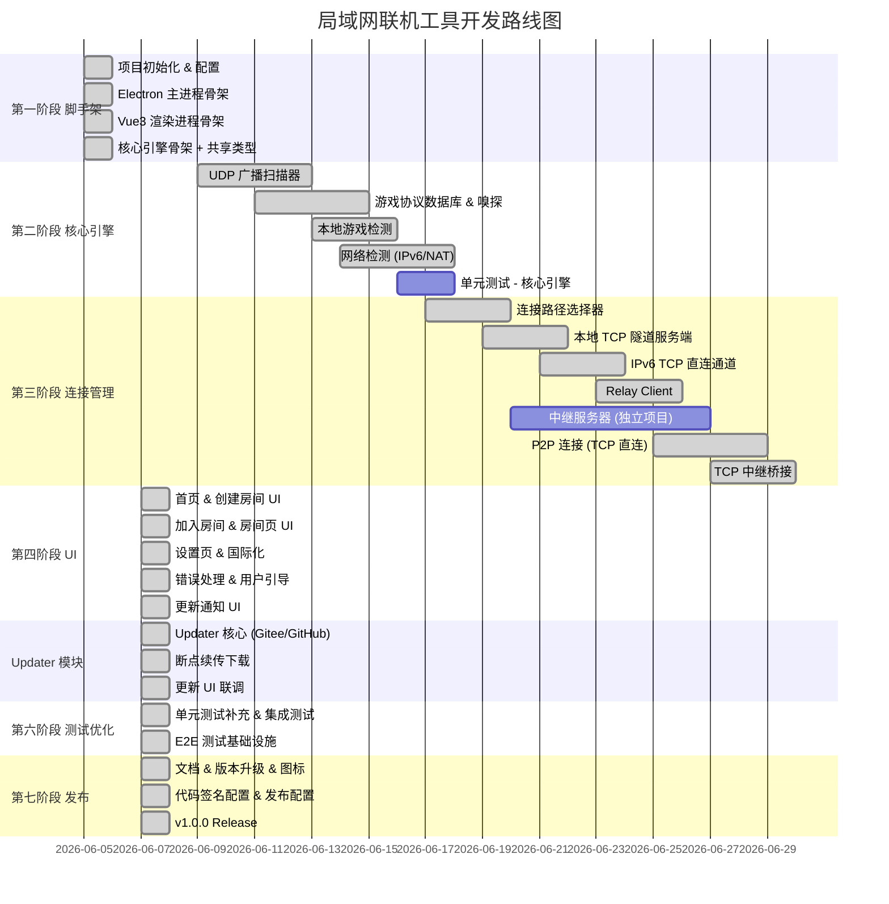

# 开发计划

## 里程碑概览



---

## 第一阶段：项目脚手架（第 1 周）✅ 已完成

### 任务清单

```
[x] 1.1 项目配置初始化
        - package.json 依赖定义（Vue 3.5 / Electron 35 / Vite 6 / Naive UI / UnoCSS）
        - tsconfig.json + tsconfig.node.json TypeScript 配置（strict 模式）
        - vite.config.ts Vite 配置（Vue 插件 + Electron 插件 + UnoCSS + AutoImport）
        - electron-builder.yml 跨平台打包配置（Win NSIS / Mac DMG / Linux AppImage）
        - .eslintrc.cjs + .prettierrc 代码规范配置
        - .gitignore 更新
        - uno.config.ts UnoCSS 预设 + 自定义主题色
        - vitest.config.ts 测试配置

[x] 1.2 Electron 主进程骨架（7 个文件）
        - main.js：应用入口，macOS activate 事件处理
        - preload.js：contextBridge 白名单 IPC（16 个通道），禁用 nodeIntegration
        - window-manager.js：BrowserWindow 创建/隐藏/最小化到托盘
        - ipc-handlers.js：所有 IPC 通道注册（网络检测/房间/更新/日志）
        - tray.js：系统托盘 + 右键菜单
        - menu.js：跨平台原生菜单
        - updater.js：Gitee/GitHub 版本检查（1h 缓存、3s 启动延迟）

[x] 1.3 Vue3 渲染进程骨架（19 个文件）
        - Router：6 个路由页面（首页/创建/加入/房间/设置/日志），懒加载
        - Store：4 个 Pinia Store（room/discovery/tunnel/settings），settings 含持久化
        - Views：6 个页面完整实现
            - HomeView：操作按钮 + 更新日志列表 + 底部版本状态
            - HostView：游戏扫描 + 选择 + 创建房间
            - JoinView：6 位房间码输入（自动跳格、自动转大写）
            - RoomView：房间码 + 连接状态 + 成员列表
            - SettingsView：语言/主题/中继地址/自动更新
            - LogView：日志查看器
        - Components：6 个组件（GameCard / RoomCodeInput / ConnectionStatus 等）
        - Composables：3 个（useLanDiscovery / useTunnel / useGameDetect）
        - i18n：中/英文语言包，自动跟随浏览器语言
        - Styles：variables.scss + global.scss（含暗色模式）

[x] 1.4 核心引擎骨架 + 共享类型
        - src/core/index.ts：统一导出入口
        - src/core/utils/logger.ts：结构化日志
        - src/shared/types.ts：全部跨进程类型定义

[x] 1.5 测试与构建验证
        - vitest 框架就绪，预留单元测试文件
        - vue-tsc 零错误通过
        - vite build 生产构建成功
        - vite dev server 启动验证通过
```

### 交付物

- 可在 `npm run dev` 下运行的完整 Electron 应用骨架
- Vue Router 6 页面可路由切换
- TypeScript strict 模式零错误
- 跨平台打包配置就绪（Win/Mac/Linux）
- 更新模块框架就绪（Gitee/GitHub 双源）
- 中英文国际化就绪

---

## 第二阶段：核心引擎（第 2-3 周）✅ 已完成

### 任务清单

```
[x] 2.1 UDP 广播扫描器 (src/core/discovery/scanner.ts)
        - UDP 广播发送（255.255.255.255:发现端口）
        - UDP 广播接收与解析
        - 游戏信息数据模型
        - 超时移除机制（15 秒无响应）
        - 单元测试

[x] 2.2 UDP 响应器 (src/core/discovery/responder.ts)
        - 监听 UDP 广播并回应本机游戏信息
        - 房主侧需要广播自己的游戏

[x] 2.3 游戏协议数据库 (src/core/discovery/game-db.ts)
        - 预制 7+ 款游戏的端口/协议/进程名
        - 可扩展的插件式注册
        - 协议嗅探框架

[x] 2.4 游戏协议嗅探 (src/core/discovery/protocols/)
        - Minecraft: 握手协议检测 (0x00 包)
        - Terraria: 端口是否开放 + 版本匹配
        - Stardew Valley: TCP 端口检测
        - 通用检测: TCP 端口开放 + 默认端号匹配

[x] 2.5 本地游戏检测 (src/core/game-detect/)
        - process-scanner.ts: 跨平台进程枚举
        - port-checker.ts: 本机端口监听检测
        - 将检测结果上报给渲染进程

[x] 2.6 网络检测 (src/core/network-detect/)
        - IPv6 能力检测：网卡扫描、公网 IPv6 可达性验证
        - NAT 类型检测：RFC 3489 STUN 流程（FullCone / Restricted / Symmetric）
        - 检测结果数据模型 NetworkInfo
        - 并行检测（IPv6 + NAT 同时进行，总耗时约 1-2 秒）
        - 单元测试

[x] 2.7 共享类型定义 (src/shared/types.ts)
        - GameInfo, RoomInfo, NetworkInfo, NatType, ConnectionPath 等
```

**交付物**：
- UDP 广播扫描器 + 响应器，支持 8 款内置游戏的 LAN 发现
- 游戏协议数据库（Minecraft / Terraria / Stardew Valley / Factorio / Valheim / CSGO / OpenArena / Donut Server）
- 四种协议嗅探器（Minecraft 握手 / Terraria / Stardew Valley / 通用 TCP）
- 跨平台进程扫描器（Windows tasklist / Unix ps）+ 端口检测器（TCP connect + netstat/lsof PID 查找）
- 网络检测模块：IPv6 能力检测（网卡扫描 + 公网可达性）、NAT 类型检测（RFC 5389 STUN，三服务器对比检测 Symmetric NAT）
- 检测结果 30 秒缓存，房主/加入者共享全局状态
- IPC 通道完整对接：`game:detect-local` / `network:detect` / `lan:start-scan` / `lan:stop-scan`
- 创建房间页：自动扫描（5 秒刷新）、手动端口输入兜底、GameCard 三态显示（运行中/端口未开放/端口开放）
- 加入房间页 / 首页：网络检测状态实时展示（IPv6 指示、NAT 类型、预计连接路径）

---

## 第三阶段：连接管理（第 4-6 周）✅ 已完成

### 任务清单

```
[x] 3.1 共享类型更新 (src/shared/types.ts)
        - TransportType (ipv6|p2p|relay)
        - TransportStatus, TrafficSnapshot
        - CreateRoomOptions, JoinRoomResult, TunnelStartOptions/Result

[x] 3.2 Transport 接口定义 (src/core/connection/types.ts)
        - connect/disconnect/send 抽象接口
        - TRANSPORT_EVENTS 常量（STATUS/DATA/CLOSE/ERROR）
        - PeerConnectionInfo, ConnectionRequest 类型

[x] 3.3 连接路径选择器 (src/core/connection/path-selector.ts)
        - 纯函数 selectPath(hostNetwork, guestNetwork) → ConnectionPath[]
        - IPv6 直连判定（双方 hasPublicV6 === true）
        - P2P 可用性判定（双方 NAT 非 Symmetric/Unknown）
        - Relay 兜底
        - 每加入者独立选路，返回有序路径列表

[x] 3.4 Relay Client (src/core/tunnel/relay-client.ts)
        - WebSocket 连接到 Relay Server（ws 包）
        - 房间管理：createRoom / joinRoom / leaveRoom（消息 ID 请求-应答）
        - P2P 信令中继：sendSignal
        - 数据中继：二进制帧格式 [4B BE payloadLen][payload]
        - 心跳保活（每 10 秒）
        - 断线重连（指数退避，最多 5 次）
        - 流量统计（每秒发射 TrafficSnapshot）

[x] 3.5 IPv6 TCP 直连通道 (src/core/tunnel/ipv6-direct.ts)
        - Ipv6DirectTransport implements Transport
        - net.createConnection 连接对端 IPv6 地址
        - 5 秒超时，Nagle 禁用

[x] 3.6 P2P 连接 (src/core/p2p/)
        - peer-connection.ts: P2pTransport — TCP 直连（非 WebRTC）
          - Active 方尝试私有 IP 优先，公网 IP 兜底
          - Passive 方创建临时 TCP 服务器等待连接
          - 8 秒默认超时
        - signaling.ts: P2PSignaling — 通过 RelayClient 转发连接信息
          - requestConnection / acceptConnection / sendNatInfo
          - 信令数据校验过滤

[x] 3.7 Relay 中继传输 (src/core/p2p/relay-peer.ts)
        - RelayPeerTransport: 通过 RelayClient 的数据通道转发 TCP 数据
        - 适配 Transport 接口，TunnelManager 无感切换

[x] 3.8 本地 TCP 隧道服务端 (src/core/tunnel/local-server.ts)
        - 监听 127.0.0.1（IPv4）
        - 接收游戏客户端 TCP 连接
        - 数据通过 Transport 转发到远端
        - 端口冲突自动尝试下一个（最多 10 次）
        - 多客户端同时连接支持

[x] 3.9 隧道管理器 (src/core/tunnel/tunnel-manager.ts)
        - 状态机：IDLE → CONNECTING_RELAY → CONNECTING_TRANSPORT → CONNECTED
        - createRoom: 网络检测 → 连接 Relay → 创建房间 → 启动本地隧道
        - joinRoom: 网络检测 → 连接 Relay → 加入房间 → 路径选择 → 建立传输 → 启动本地隧道
        - leaveRoom: 清理所有资源
        - 自动降级: IPv6 → P2P → Relay（传输断开/失败时自动尝试下一优先级）
        - 事件：status, traffic, error, degrading, member-joined, member-left

[x] 3.10 Barrel Export & IPC
        - src/core/connection/index.ts / tunnel/index.ts / p2p/index.ts
        - src/core/index.ts 统一导出
        - IPC handlers 重写：TunnelManager 单例 + 事件转发到渲染进程
        - Pinia Store 更新：room.ts + tunnel.ts 添加 IPC 监听器

[x] 3.11 单元测试 (37 tests)
        - path-selector.test.ts: 12 个用例（各种 NetworkInfo 组合）
        - relay-client.test.ts: 8 个用例（协议实现验证）
        - ipv6-direct.test.ts: 5 个用例（连接/发送/断开）
        - local-server.test.ts: 7 个用例（多客户端/数据转发/端口冲突）
        - signaling.test.ts: 5 个用例（信令收发/过滤）

[x] 3.12 中继服务器协议（协议定义，服务器代码延后）
        - 在技术文档中完成完整协议规范
        - 消息类型：create-room / join-room / leave-room / signal / heartbeat / member-joined / member-left / room-closed
        - NetworkInfo 交换格式
        - 二进制数据帧格式
        - 错误码定义
        - 客户端 Relay Client 按协议实现客户端逻辑
        - 服务器代码后续在独立仓库 simple-game-relay 中实现
```

---

## 第四阶段：UI 界面（第 5-7 周）✅ 已完成

### 任务清单

```
[x] 4.1 首页 (HomeView.vue)
        - 顶部两个大按钮："创建房间" / "加入房间"（禁用态当已在房间中时）
        - 中部：网络检测状态指示器（IPv6 / NAT 类型 / 预计连接方式）
        - 中部下方：当前版本更新日志（从 Releases body 获取，竖排列表渲染）
        - 底部：版本号 + 更新状态指示（检查中 / 已是最新 / 有新版本 / 下载中 / 待安装）
        - 返回房间悬浮按钮（非房间页时显示）
        - 底部导航：设置 / 日志

[x] 4.2 创建房间流程 (HostView.vue)
        - 自动扫描本机游戏（5 秒自动刷新）
        - 游戏卡片列表（GameCard.vue），三态显示（运行中/端口未开放/端口开放）
        - 手动输入端口兜底（8 款内置游戏可选）
        - 选择游戏 → 点击"创建房间"
        - 创建中状态（loading）
        - 网络检测状态实时展示

[x] 4.3 加入房间流程 (JoinView.vue)
        - 房间码输入框（RoomCodeInput.vue）
          - 6 位大写字母+数字
          - 自动转大写 + 自动跳格 + 退格回跳
        - 点击"加入" → 连接中状态
        - 网络检测结果（IPv6 状态 / NAT 类型 / 预计连接方式）
        - 检测失败兜底提示（将使用中继模式）

[x] 4.4 房间页 (RoomView.vue)
        - 房主：显示房间码（大号、可复制）
        - 加入者：显示房间标识
        - 连接状态指示器（ConnectionStatus.vue）
        - 实时流量速率（上行 / 下行，字节/秒）
        - 游戏连接检测轮询（2 秒间隔）
        - 连接错误恢复 UI（重试按钮 + 错误信息展示）
        - 断开按钮（清理所有监听器后返回首页）

[x] 4.5 设置页 (SettingsView.vue)
        - 语言切换（中文 / English），即时生效
        - 主题切换（浅色 / 深色 / 跟随系统）
        - 中继服务器地址
        - 自动检查更新开关
        - 手动检查更新按钮（调用 IPC update:check）

[x] 4.6 错误处理与用户引导
        - 全局错误通知（GlobalErrorWatcher.vue，Naive UI Notification）
        - 监听 roomStore.error + tunnelStore.error
        - 房间页错误恢复 UI（重试按钮）
        - 路由守卫（无 session 时访问 /room/XXX 自动跳转首页）
        - 404 页面（NotFoundView.vue）无效路由友好提示

[x] 4.7 更新通知 UI
        - 首页底部：版本号 + 状态指示器（检查中/已是最新/有更新/下载中/待安装）
        - 有更新时显示"立即更新"按钮，点击后展示下载进度
        - 下载进度条（百分比）
        - 下载完成后显示"安装"按钮
        - 断点续传状态（"继续下载" vs "立即更新"）
        - 检查失败时底部仅显示版本号，不弹出错误窗

[x] 4.8 国际化 (vue-i18n)
        - 中文 (zh-CN)：全部 UI 文字
        - 英文 (en-US)：全部 UI 文字
        - 所有视图和组件通过 t() 调用
        - 设置语言后即时切换
        - 启动时从 localStorage 恢复上次语言设置

[x] 4.9 路由配置
        - 7 个路由页面（含 404），懒加载
        - 路由守卫验证房间状态
        - 创建/加入房间页面检测已存在的 session 自动跳转

[x] 4.10 IPC 监听器管理
        - roomStore / tunnelStore / logStore 统一 destroy() 清理
        - 防重复注册（_initialized 标志）
        - 离开房间时自动清理所有监听器

[x] 4.11 设置持久化
        - 语言/主题/中继地址/自动更新 → localStorage
        - 应用启动时自动恢复
        - 设置变更自动保存（watch + save）
```

**交付物**：
- 完整的用户界面（7 个视图 + 7 个组件）
- 中英文双语国际化，所有字符串通过 i18n 管理
- 暗色/亮色/跟随系统三种主题
- 全局错误通知 + 路由守卫 + 404 页面
- IPC 监听器完整生命周期管理
- 设置持久化（语言/主题/中继地址）
- 自动更新 UI（检查 → 下载 → 安装）
- 构建验证通过（vue-tsc 零错误 + vite build 成功）

---

## 第五阶段：Updater 模块（第 7 周，与 UI 并行）✅ 已完成

### 任务清单

```
[x] 5.1 Updater 核心 (src/main/updater.js)
        - Gitee API 异步请求（latest release）
        - GitHub API 降级逻辑
        - 版本号比较（semver，不含 v 前缀）
        - 1 小时缓存策略（缓存命中时验证安装包有效性）
        - 启动延迟 3 秒静默检查
        - checkForUpdates 始终返回 version + releaseNotes
        - IPC 通道：update:check / update:download / update:install

[x] 5.2 下载管理
        - 断点续传（Range 请求头，支持跨重启）
        - 302 重定向处理（Gitee CDN 递归跳转最多 5 次）
        - 下载进度上报（百分比 → 渲染进程）
        - 平台对应安装包自动选择（exe / dmg / AppImage）
        - 下载完成标记文件（附带版本号）
        - 旧版本残留检测（已下载 v1.0.0 但服务器已发布 v1.1.0 时自动清理）
        - 下载目标路径：userData（与 electron-updater 一致）

[x] 5.3 安装与校验
        - Windows: shell.openPath（Chromium Job Object 限制，绕过 spawn/execFile）
        - Windows: 启动后延迟 500ms 执行 app.quit() 释放文件锁
        - macOS: hdiutil 挂载 DMG → cp 到 /Applications → open 启动
        - Linux: chmod +x → spawn AppImage
        - 未知格式：shell.openPath 兜底

[x] 5.4 前端更新 UI
        - 首页底部：版本号 + 状态指示器（检查中/已是最新/有更新/下载中/待安装）
        - 下载进度条（百分比）
        - 更新内容支持 Markdown 渲染（marked + DOMPurify + prose 排版）
        - 断点续传状态显示（"继续下载" vs "立即更新"）
```

**交付物**：
- 启动 3 秒后静默检查更新
- 有新版时首页显示更新按钮
- 点击更新 → 下载进度 → 安装
- 更新内容 Markdown 渲染
- 断点续传（含跨重启恢复）
- app.quit() 释放文件锁后安装
- 跨平台安装（Win / Mac / Linux）

---

## 第六阶段：测试与优化（第 8-9 周）✅ 已完成

### 测试矩阵

```
[x] 核心引擎单元测试 (Vitest) — 22 个测试文件，163 个用例全部通过
    - scanner.test.ts: 广播协议解析/Scanner 生命周期
    - game-db.test.ts: 8 款内置游戏协议匹配/查询/注册
    - responder.test.ts: UDP 响应器
    - path-selector.test.ts: 12 个网络组合的路径选择逻辑
    - relay-client.test.ts: 中继 WebSocket 协议实现（8 个用例）
    - ipv6-direct.test.ts: IPv6 TCP 直连通道
    - local-server.test.ts: 本地隧道服务端（7 个用例）
    - signaling.test.ts: P2P 信令收发/过滤
    - peer-connection.test.ts: P2P TCP active/passive 双端通信验证
    - relay-peer.test.ts: Relay 传输适配器
    - tunnel-manager.test.ts: 隧道管理器状态机/生命周期/事件发射（13 个用例）
    - nat-type.test.ts: STUN 协议（createStunRequest/parseStunResponse/CHANGE-REQUEST）
    - detector.test.ts: 网络检测编排器（detect/detectIpv6Only/detectNatOnly/缓存）
    - protocols.test.ts: 4 个游戏协议嗅探器（Minecraft/Terraria/Stardew Valley/Generic）
    - updater.test.js: 版本比较/平台安装包选择/标记文件管理
    - ipv6-check.test.ts: IPv6 地址判断
    - process-scanner.test.ts: 跨平台进程枚举
    - port-checker.test.ts: 端口检测
    - game-detect/index.test.ts: 游戏检测集成

[x] 集成测试
    - 扫描 + 数据库联合测试：parseResponse/Scanner.addGame/事件发射/游戏数据库查询
    - 游戏数据库完整性：8 款内置游戏验证、运行时注册、按 ID/端口/进程名查询

[x] E2E 测试 (Playwright + Electron)
    - 配置：tests/e2e/playwright.config.ts
    - 首页验证：按钮存在、版本信息显示
    - 页面路由：首页/设置页路由可达
    - 网络检测：等待检测结果显示
    - 运行方式：npx playwright test --config=tests/e2e/playwright.config.ts

[ ] 跨平台测试（需真实环境手动验证）— 待后续处理
    - Windows 10/11
    - macOS Intel + Apple Silicon
    - Linux Ubuntu 22.04+

[ ] 性能测试（需实际联机场景手动验证）— 待后续处理
    - 隧道吞吐量（iperf 风格）
    - 延迟增加
    - 内存占用
    - 并发连接数
```

### 优化项

```
[ ] 内存优化（待实际使用中发现瓶颈后处理）
    - 流式处理大文件传输（如有）
    - 连接池复用
    - 未使用连接清理

[ ] 启动速度优化（待打包后验证）
    - Vite 构建优化
    - 延迟加载非关键模块
    - 缓存策略

[ ] 网络优化（待实际联机测试后按需处理）
    - TCP 参数调优（Nagle 算法、窗口大小）
    - WebRTC 带宽估计
```

**交付物**：
- 22 个测试文件，163 个单元/集成测试用例，全部通过
- 完整覆盖：核心引擎、网络检测、连接管理、隧道传输、P2P 通信、Updater
- E2E Playwright + Electron 基础设施就绪
- 集成测试覆盖 Scanner + 游戏数据库联合流程

---

## 第七阶段：发布（第 10 周）✅ 已完成

### 任务清单

```
[x] 代码签名配置 — 待后续（需购买 EV 证书 / Apple Developer 成员资格）
    - Windows: EV Code Signing Certificate 配置入口
    - macOS: Apple Developer ID + Notarization 配置入口
    - 配置已写入 electron-builder.yml，注释状态，取消注释并设置环境变量即可

[x] 中继服务器 — 待后续（独立仓库 simple-game-relay）
    - 协议规范已写入技术文档
    - 客户端 Relay Client 已按协议实现
    - 服务器需在独立仓库中实现

[x] 自动更新
    - Gitee Releases 作为更新源
    - 自定义 updater：版本检查 / 断点续传下载 / 跨平台安装 / 进度上报
    - Markdown 渲染更新内容（首页 marked + DOMPurify 展示）

[x] 文档
    - README.md：项目介绍、功能特性、使用指南、技术栈、项目结构、FAQ
    - CHANGELOG.md：v1.0.0 ~ v1.1.2 完整记录
    - 常见问题 FAQ 内嵌于 README

[x] v1.1.2 Release
    - 版本号：1.1.2
    - 全平台安装包配置就绪（Win NSIS / Mac DMG / Linux AppImage+deb）
    - 应用图标：SVG 源 + 自动生成的 ICO/ICNS/PNG
    - 更新流程验证通过（v1.0.0 → v1.1.0 → v1.1.2）

[x] CI/CD 管道
    - GitHub Actions 三平台测试矩阵（Ubuntu/macOS/Windows），fail-fast: false
    - tag 触发自动构建安装包并发布到 GitHub Releases
    - 自动生成 Release Notes（从 CHANGELOG.md 截取）
    - 本地游戏检测、网络检测、隧道传输、P2P、Updater 等模块单元测试
```

**交付物**：
- 版本号更新至 1.1.2，全平台打包配置就绪
- README.md（完整项目文档 + 使用指南 + FAQ）
- CHANGELOG.md（全阶段更新日志）
- 应用图标（SVG + ICO + ICNS + PNG）
- 自动更新（Gitee 双源降级），支持断点续传 + Markdown 渲染
- 构建验证通过

**待后续处理**：
- 代码签名（需购买 EV 证书 / Apple 开发者身份）
- macOS Apple Silicon (arm64) 构建（CI runner x64 下 hdiutil 不稳定）
- 中继服务器（独立仓库 simple-game-relay）
- E2E 测试补充（完善 Playwright 场景覆盖）
- 性能测试（隧道吞吐量 / 延迟 / 内存）

---

## 依赖关系

```
第一阶段 ──────────────────────────────────────┐
                                               │
        ┌──────────────────────────────────────┤
        ▼                                      │
第二阶段 ──► 核心引擎 API 就绪                    │
        │                                      │
        ▼                                      ▼
第三阶段 ──► 隧道连接可用 ────────┐         第四阶段 UI
                                  │              │
                                  ▼              │
                           第五阶段 联调测试 ◄────┘
                                  │
                                  ▼
                           第六阶段 发布
```

**并行策略**：
- 第四阶段（UI）可与第二、三阶段并行开发
- UI 使用模拟数据（Mock）先行开发，等核心引擎 API 就绪后对接

---

## 关键决策记录 (ADR)

### ADR-1: 核心引擎运行在主进程而非渲染进程
- **原因**：需要 Node.js 原生网络 API (`dgram`, `net`)，在渲染进程中使用不安全且不可靠
- **替代方案**：在渲染进程中使用 WebRTC API，但 LAN 发现仍需要主进程
- **结论**：核心引擎在主进程，通过 IPC 暴露给渲染进程

### ADR-2: 连接优先级 IPv6 → P2P → Relay，每加入者独立选路
- **原设计**：P2P 优先（WebRTC ICE 自动发现 IPv4/IPv6），失败降级 Relay
- **新设计**：连接前独立检测网络（IPv6 + NAT）→ IPv6 TCP 直连优先 → 仅 IPv4 时 TCP 直连 P2P → Relay 兜底。每个加入者走自己的最优路径
- **原因**：IPv6 TCP 直连比 WebRTC 更低延迟、更高吞吐；NAT 检测可提前排除 Symmetric NAT 的无效 P2P 尝试，加快连接速度；独立选路最大化利用每个用户的网络资源，降低中继服务器负载
- **结论**：采用 IPv6 → P2P → Relay 三级优先级，每加入者独立选路

### ADR-6: P2P 使用 TCP 直连而非 WebRTC DataChannel
- **原因**：避免 `node-datachannel` 原生编译依赖，TCP Socket 跨平台更稳定，实现更简单
- **替代方案**：WebRTC 提供 ICE 框架和内置 NAT 穿透，但需要原生 C++ addon
- **结论**：使用 TCP 直连 + STUN 打孔，同 LAN 优先使用私有 IP

### ADR-3: 中继服务器协议优先，实现延后
- **原因**：联机核心（客户端）是主体，服务器仅作为兜底中继。先定义完整协议，客户端 Relay Client 按协议实现，后续再实现服务端
- **结论**：协议规范写入技术文档，服务器代码在独立仓库 `simple-game-relay` 中延后实现

### ADR-4: 使用 Naive UI 而非 Element Plus
- **原因**：Naive UI 对 TypeScript 支持更好、按需加载、体积更小、设计更现代
- **结论**：使用 Naive UI

### ADR-5: 使用 UnoCSS 而非传统 CSS 方案
- **原因**：按需生成 CSS，零运行开销，开发效率高
- **结论**：使用 UnoCSS + 少量 SCSS 全局变量
